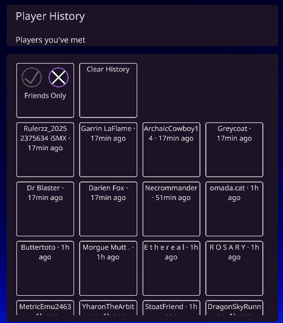

# Player History

## What it does

Every time a player joins your instance they are added to your history. The mod stores the last 10 encounter timestamps per player and keeps at most 100 players total, dropping the oldest when the limit is reached.

The history is saved to `UserData/PlayerHistory.tsv` and persists between sessions.

## Usage

Open the QuickMenu and navigate to the **Player History** tab.

- The list shows all recorded players sorted by most recently seen, with a relative time next to each name.
- Clicking a player opens a detail page listing each recorded encounter with its date and time.
- **Friends Only** — filters the list to only show players on your CVR friends list.
- **Clear History** — opens a confirmation dialog before deleting all records.

When you select a player from the player list in the QuickMenu, the Player History section shows when you last saw them and provides an **Open Details** button to jump to their CVR profile page.

